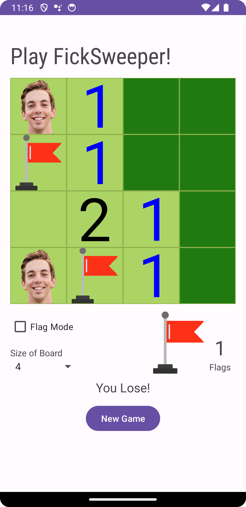

# FickSweeper Project

## About

This is a Minesweeper mobile app implementation, which is written in Kotlin and can be played in square fields of any size between 4 and 9.

To run, simply press play on the emulator in Android Studio, and have fun!

(To be clear, my face is the mine, since this is the FickSweeper, after all!)

### Example Screen 

